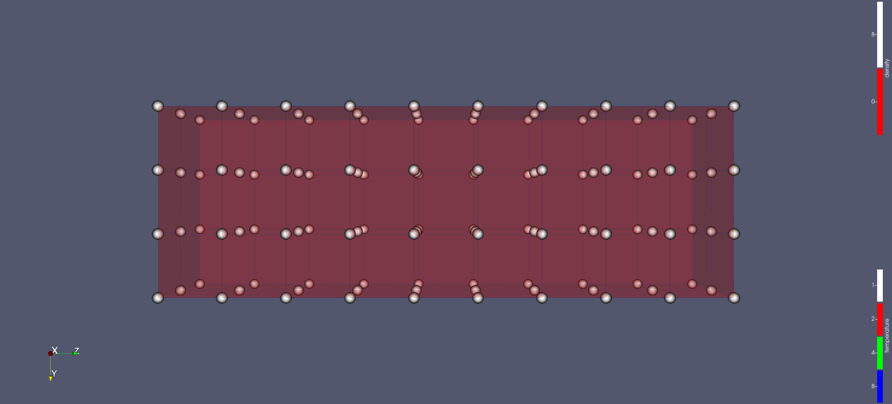
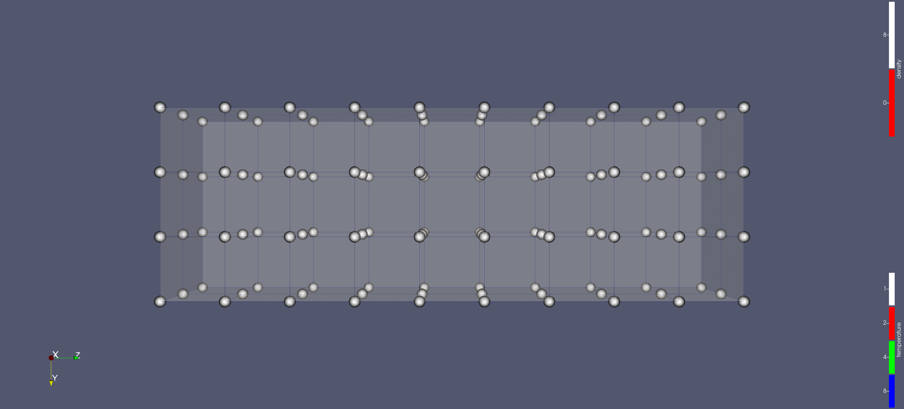

{ align=right style="width:250px"}

# Staggered Grids  - Experimental [WIP]

Staggered grids are crucial for numerical methods like the finite element method.
Neon natively provides a staggered-grid abstraction over Neon uniform grids.
In other words, we can create a staggered grid using any of the uniform grids such as dGrid (dense), eGrid (sparse), bGrid (sparse).

Node Grid and Voxel Grid are Neon's terminology to distinguish between the primal and dual grid of a staggered configuration. The following image is just a 2D example of a staggered grid, where the node grid is highlighted in blue, and the voxel grid is in green.

{align=center style="width:400px"}

Node Grid and Voxel Grid provide the same compute API that Neon uniform grids offer.
However, they also include functionality to jump from nodes to voxels and vice-versa.

Staggered grid provides mechanisms to create containers running on nodes or voxels. 
The created containers are fully compatible with the Neon Skeleton model. 

<a name="cartesian">
## Initialization
</a>

```cpp linenums="13" title="Neon/tutorials/staggered-grids/src/staggeredGrid.cpp"
int main()
{// Selecting the hardware for the computation
    Neon::Backend backend = [] {
        Neon::init();
        // Our XPU will be a CPU device.
        auto runtime = Neon::Runtime::openmp;
        // We are overbooking XPU 0 two times
        std::vector<int> gpu_ids{0, 0};
        Neon::Backend    backend(gpu_ids, runtime);
        return backend;
    }();

    // Define an alias for our staggered grid
    using UniformGrid = Neon::domain::dGrid;
    using StaggeredGrid = Neon::domain::internal::experimental::staggeredGrid::StaggeredGrid<UniformGrid>;
    using FP = double;
    using UserContainers = tools::Containers<StaggeredGrid, FP>;

    // Initializing a staggered grid based on dGrid
    StaggeredGrid grid = [&] {
        // Setting the dimension for the voxel grid
        Neon::int32_3d voxDims{2, 3, 9};

        // For our tutorial, we don't need to add new stencil.
        // By default, the staggered grid will add the stencil
        // to move from voxel to node and vice versa
        std::vector<Neon::domain::Stencil> noExtraStencils;

        StaggeredGrid newGrid(
            backend,
            voxDims,
            [](const Neon::index_3d&) -> bool {
                return true;
            },
            noExtraStencils);

        return newGrid;
    }();
    
    return 0;
}
```

<a name="fields">
## Node and voxel fields
</a>

```cpp linenums="49" title="Neon/tutorials/staggered-grids/src/staggeredGrid.cpp"
    // ...

    auto density = [&grid] {
        // Defining a voxel field to represent the density of each voxel
        // We then set its initial values to zero in the host (CPU),
        // and finally we transfer the data to the XPU
        auto density = grid.template newVoxelField<FP, 1>("Density", 1, 0);
        density.forEachActiveCell([](const Neon::index_3d& /*idx*/,
                                     const int& /*cardinality*/,
                                     FP& value) {
            value = 0;
        });
        density.updateCompute(Neon::Backend::mainStreamIdx);
        return density;
    }();

    auto temperature = [&grid] {
        // Defining a node field to represent the temperature at each node
        // We then set its initial values to one, but to make it more interesting,
        // we do the initialization directly on the device calling a Containers.
        // Note that in this case we don't need to transfer data from host to XPUs
        auto temperature = grid.template newNodeField<FP, 1>("Temperature", 1, 0);
        temperature.forEachActiveCell([](const Neon::index_3d& /*idx*/,
                                         const int& /*cardinality*/,
                                         FP& value) {
            value = 0;
        });
        UserContainers::resetValue(temperature, FP(1.0)).run(Neon::Backend::mainStreamIdx);
        return temperature;
    }();

    // We define a simple function to export to vtk both
    // temperature and density field during each step of the tutorial.
    auto exportingToVti = [&](const std::string& tutorialStepId) {
        {  // Moving memory from XPUs to CPU
            temperature.updateIO(Neon::Backend::mainStreamIdx);
            density.updateIO(Neon::Backend::mainStreamIdx);
            backend.sync(Neon::Backend::mainStreamIdx);
        }
        {  // Exporting the results
            const std::string appName("staggered-grid");
            temperature.ioToVtk(appName + "-temperature-" + tutorialStepId, "temperature", false, Neon::IoFileType::BINARY);
            density.ioToVtk(appName + "-density-" + tutorialStepId, "density");
        }
    };

    // We are exporting to vtk the values of the fields after the initialization.
    // We expect all temperature nodes to be set to one,
    // and all density voxels to be set to zero.
    exportingToVti("0000");

    return 0;
}
```

```cpp linenums="49" title="Neon/tutorials/staggered-grids/src/staggeredGrid.cpp"
template <typename StaggeredGrid, typename T>
auto Containers<StaggeredGrid, T>::resetValue(Self::NodeField  field,
                                              const Self::Type alpha) -> Neon::set::Container
{
    return field.getGrid().getContainerOnNodes(
        "addConstOnNodes",
        [&](Neon::set::Loader& loader) {
            auto& out = loader.load(field);

            return [=] NEON_CUDA_HOST_DEVICE(const typename Self::NodeField::Node& e) mutable {
                for (int i = 0; i < out.cardinality(); i++) {
                    out(e, i) = alpha;
                }
            };
        });
}
```




<a name="cartesian">
## Stencil operations: accessing voxels from nodes
</a>

```cpp linenums="71" title="Neon/tutorials/staggered-grids/src/staggeredGrid.cpp"
    // ... 
    
    {  // Accessing voxels from nodes
       // For each node we loop around active voxel, and we sum their values.
       // At the end of this operation we expect all voxel to store a value of 8,
       // as there are 8 nodes for each voxel, each one set to one.
        UserContainers::sumNodesOnVoxels(density, temperature)
            .run(Neon::Backend::mainStreamIdx);

        exportingToVti("0001");
    }
        
    return 0;
}
```

```cpp linenums="79" title="Neon/tutorials/staggered-grids/src/containers.cu"
template <typename StaggeredGrid, typename T>
auto Containers<StaggeredGrid, T>::sumVoxelsOnNodesAndDivideBy8(Self::NodeField&        temperatureField,
                                                                const Self::VoxelField& densityField) -> Neon::set::Container
{
    return temperatureField.getGrid().getContainerOnNodes(
        "sumVoxelsOnNodesAndDivideBy8",
        // Neon Loading Lambda
        [&](Neon::set::Loader& loader) {
            const auto& density = loader.load(densityField, Neon::Compute::STENCIL);
            auto&       temperature = loader.load(temperatureField);

            auto nodeSpaceDim = temperatureField.getGrid().getDimension();

            // Neon Compute Lambda
            return [=] NEON_CUDA_HOST_DEVICE(const typename Self::NodeField::Node& nodeHandle) mutable {
                Type sum = 0;

                constexpr int componentId = 0;
                constexpr int returnValueIfVoxelIsNotActive = 0;

                // We visit all the neighbouring voxels around nodeHandle.
                // Relative discrete offers are used to identify the neighbour node.
                // Note that some neighbouring nodes may be not active.
                // Rather than explicitly checking we ask Neon to return 0 if the node is not active.
                sum += density.template getNghVoxelValue<1, 1, 1>(nodeHandle, componentId, returnValueIfVoxelIsNotActive).value;
                sum += density.template getNghVoxelValue<1, 1, -1>(nodeHandle, componentId, returnValueIfVoxelIsNotActive).value;
                sum += density.template getNghVoxelValue<1, -1, 1>(nodeHandle, componentId, returnValueIfVoxelIsNotActive).value;
                sum += density.template getNghVoxelValue<1, -1, -1>(nodeHandle, componentId, returnValueIfVoxelIsNotActive).value;
                sum += density.template getNghVoxelValue<-1, 1, 1>(nodeHandle, componentId, returnValueIfVoxelIsNotActive).value;
                sum += density.template getNghVoxelValue<-1, 1, -1>(nodeHandle, componentId, returnValueIfVoxelIsNotActive).value;
                sum += density.template getNghVoxelValue<-1, -1, 1>(nodeHandle, componentId, returnValueIfVoxelIsNotActive).value;
                sum += density.template getNghVoxelValue<-1, -1, -1>(nodeHandle, componentId, returnValueIfVoxelIsNotActive).value;

                // Storing the final result in the target node.
                temperature(nodeHandle, 0) = sum / 8;
            };
        });
}

```

{style="width:500px"}




<a name="cartesian">
## Stencil operations: accessing nodes from voxels
</a>

```cpp linenums="49" title="Neon/tutorials/staggered-grids/src/staggeredGrid.cpp"
    {  // Accessing nodes from voxels
       // For each voxel we loop around all nodes, we sum their values and divide the result by 8.
       // At the end of the container we expect to have the following values:
       // -- 1 for any corner node
       // -- 2 for any node on an edge of our domain
       // -- 3 for any node on a face
       // -- 4 for internal nodes
        UserContainers::sumVoxelsOnNodesAndDivideBy8(temperature,
                                                     density)
            .run(Neon::Backend::mainStreamIdx);

        exportingToVti("0002");
    }
    
    return 0;
}
```

```cpp linenums="49" title="Neon/tutorials/staggered-grids/src/containers.cu"
template <typename StaggeredGrid, typename T>
auto Containers<StaggeredGrid, T>::sumNodesOnVoxels(Self::VoxelField&      densityField,
                                                    const Self::NodeField& temperatureField)
    -> Neon::set::Container
{
    return densityField.getGrid().getContainerOnVoxels(
        "sumNodesOnVoxels",
        // Neon Loading Lambda
        [&](Neon::set::Loader& loader) {
            auto&       density = loader.load(densityField);
            const auto& temperature = loader.load(temperatureField, Neon::Compute::STENCIL);

            // Neon Compute Lambda
            return [=] NEON_CUDA_HOST_DEVICE(const typename Self::VoxelField::Voxel& voxHandle) mutable {
                Type          sum = 0;
                constexpr int componentId = 0;

                // We visit all the neighbour nodes around voxHandle.
                // Relative discrete offers are used to identify the neighbour node.
                // As by construction all nodes of a voxel are active, we don't have to do any extra check.
                sum += temperature.template getNghNodeValue<1, 1, 1>(voxHandle, componentId);
                sum += temperature.template getNghNodeValue<1, 1, -1>(voxHandle, componentId);
                sum += temperature.template getNghNodeValue<1, -1, 1>(voxHandle, componentId);
                sum += temperature.template getNghNodeValue<1, -1, -1>(voxHandle, componentId);
                sum += temperature.template getNghNodeValue<-1, 1, 1>(voxHandle, componentId);
                sum += temperature.template getNghNodeValue<-1, 1, -1>(voxHandle, componentId);
                sum += temperature.template getNghNodeValue<-1, -1, 1>(voxHandle, componentId);
                sum += temperature.template getNghNodeValue<-1, -1, -1>(voxHandle, componentId);

                // Storing the final result in the target voxel.
                density(voxHandle, 0) = sum;
            };
        });
}
```

