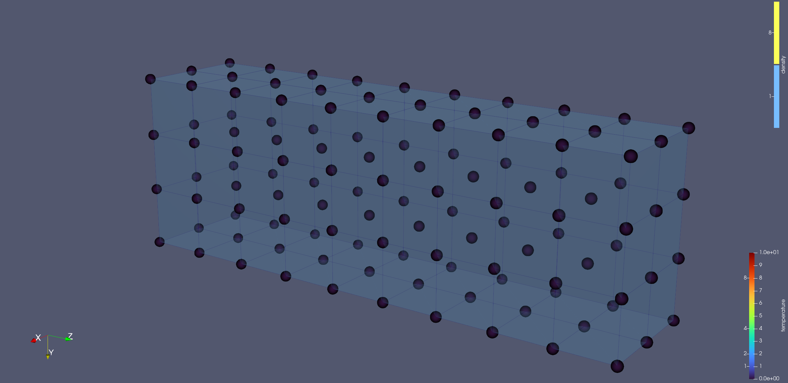
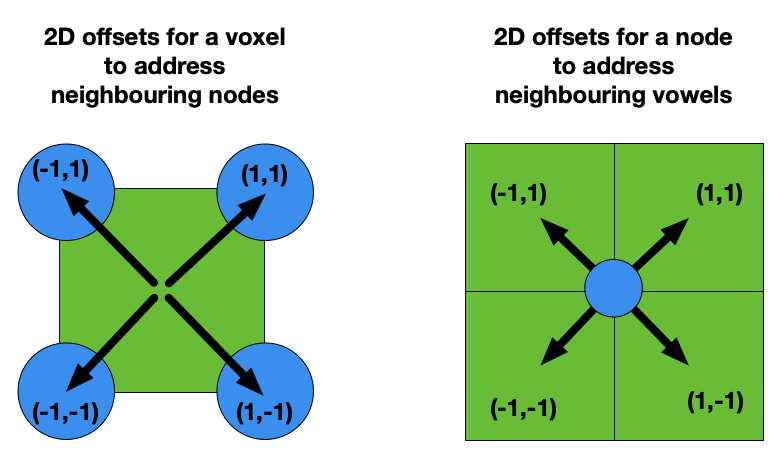
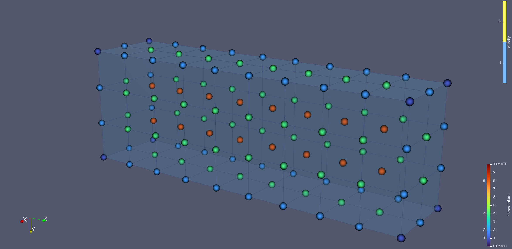
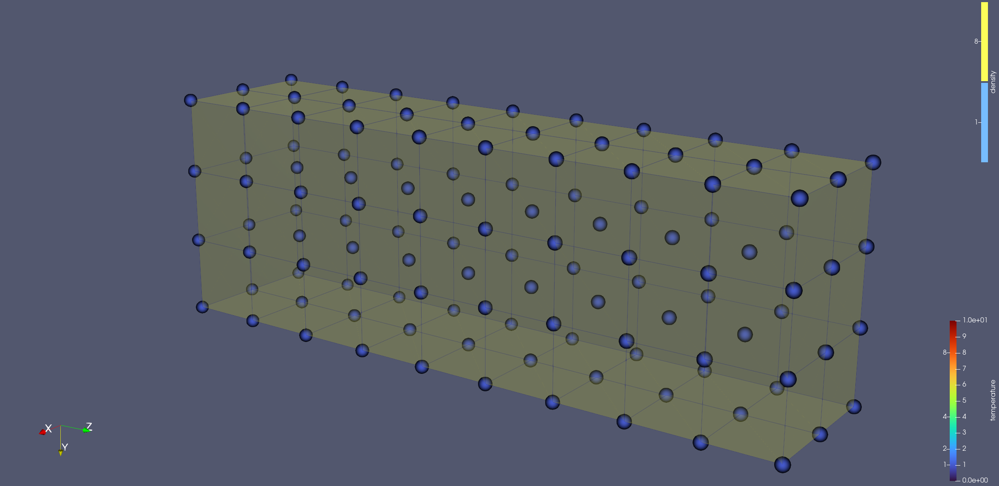

{ align=right style="width:250px"}

# Staggered Grids  - Experimental [WIP]

Staggered grids are crucial for numerical methods like the finite element method.
Neon natively provides a staggered-grid abstraction over Neon uniform grids.
In other words, we can create a staggered grid using any of the uniform grids such as dGrid (dense), eGrid (sparse), bGrid (sparse).

Node Grid and Voxel Grid are Neon's terminology to distinguish between the primal and dual grid of a staggered configuration. The following image is just a 2D example of a staggered grid, where the node grid is highlighted in blue, and the voxel grid is in green.

{align=center style="width:400px"}

Node Grid and Voxel Grid provide the same compute API that Neon uniform grids offer.
However, they also include functionality to jump from nodes to voxels and vice-versa.

Staggered grid provides mechanisms to create containers running on nodes or voxels. 
The created containers are fully compatible with the Neon Skeleton model. 

<a name="cartesian">
## Initialization
</a>

```cpp linenums="9" title="Neon/tutorials/staggered-grids/src/staggeredGrid.cpp"
    // Step 0 -> initialize Neon runtime
    Neon::init();

    // Step 1 -> Neon backend: choosing the hardware for the computation
    Neon::Backend backend = [] {
        // auto runtime = Neon::Runtime::openmp;
        auto runtime = Neon::Runtime::openmp;
        // We are overbooking GPU 0 three times
        std::vector<int> gpu_ids{0,0};
        Neon::Backend    backend(gpu_ids, runtime);

        // Printing some information
        NEON_INFO(backend.toString());
        return backend;
    }();

    // Define an alias for our staggered grid
    using UniformGrid = Neon::domain::dGrid;
    using StaggeredGrid = Neon::domain::internal::experimental::staggeredGrid::StaggeredGrid<UniformGrid>;
    using FP = double;

    StaggeredGrid grid = [&] {
        // Setting the dimension for the voxel grid
        Neon::int32_3d                     voxDims{2, 3, 9};

        // For our example we don't need to add new stencil.
        // By default the staggered grid will add the stencil
        // to move from voxel to node and vice versa
        std::vector<Neon::domain::Stencil> noExtraStencils;

        StaggeredGrid newGrid(
            backend,
            voxDims,
            [](const Neon::index_3d&) -> bool {
                return true;
            },
            noExtraStencils);
        return newGrid;
    }();

    
    return 0;
```

<a name="fields">
## Node and voxel fields
</a>

```cpp linenums="49" title="Neon/tutorials/staggered-grids/src/staggeredGrid.cpp"
    // ...
    
    auto density = grid.template newVoxelField<FP, 1>("Density", 1, 0);
    density.forEachActiveCell([](const Neon::index_3d& /*idx*/,
                                 const int& /*cardinality*/,
                                 FP& value) {
        value = 1;
    });

    auto temperature = grid.template newNodeField<FP, 1>("Temperature", 1, 0);
    temperature.forEachActiveCell([](const Neon::index_3d& /*idx*/,
                                 const int& /*cardinality*/,
                                 FP& value) {
        value = 0;
    });

    const std::string appName("staggered-grid");

    temperature.ioToVtk(appName + "-temperature_0000", "temperature");
    temperature.ioToVtk(appName + "-temperature_binary_0000", "temperature", false, Neon::IoFileType::BINARY);
    density.ioToVtk(appName + "-density_0000", "density");
    
    return 0;
```



<a name="cartesian">
## Stencil operations: accessing voxels from nodes
</a>

```cpp linenums="71" title="Neon/tutorials/staggered-grids/src/staggeredGrid.cpp"
    // ... 
    
    {  // Moving memory from CPU to the GPUs
        temperature.updateCompute(Neon::Backend::mainStreamIdx);
        density.updateCompute(Neon::Backend::mainStreamIdx);
    }


    { // Accessing voxels from nodes
        {
            // We use halo update as we are working only at the domain level.
            // When leveraging the skeleton abstractions, hlo update are automatically
            // handled by Neon.
            Neon::set::HuOptions huOptions(Neon::set::TransferMode::get,
                                           true,
                                           Neon::Backend::mainStreamIdx);
            density.haloUpdate(huOptions);
        }

        // For each nodes we loop around active voxel and we sum their values.
       Containers<StaggeredGrid, FP>::sumVoxelsOnNodes(temperature, density).run(Neon::Backend::mainStreamIdx);

        temperature.updateIO(Neon::Backend::mainStreamIdx);
        density.updateIO(Neon::Backend::mainStreamIdx);
        backend.sync(Neon::Backend::mainStreamIdx);

        // Exporting the results
        temperature.ioToVtk(appName + "-temperature_binary_0001", "temperature", false, Neon::IoFileType::BINARY);
        density.ioToVtk(appName + "-density_0001", "density");
    }


        
    return 0;
```

```cpp linenums="79" title="Neon/tutorials/staggered-grids/src/containers.cu"
template <typename StaggeredGrid, typename T>
auto Containers<StaggeredGrid, T>::sumVoxelsOnNodes(Self::NodeField&        temperatureField,
                                                    const Self::VoxelField& densityField) -> Neon::set::Container
{

    using Type = typename Self::NodeField::Type;

    return temperatureField.getGrid().getContainerOnNodes(
        "sumVoxelsOnNodes",
        [&](Neon::set::Loader& loader) {
            const auto& density = loader.load(densityField, Neon::Compute::STENCIL);
            auto&       temperature = loader.load(temperatureField);

            auto nodeSpaceDim = temperatureField.getGrid().getDimension();

            return [=] NEON_CUDA_HOST_DEVICE(const typename Self::NodeField::Node& nodeHandle) mutable {
                Type sum = 0;

#define CHECK_DIRECTION(X, Y, Z)                                                              \
    {                                                                                         \
        Type nghDensity = density.template getNghVoxelValue<X, Y, Z>(nodeHandle, 0, 0).value; \
        sum += nghDensity;                                                                    \
    }

                CHECK_DIRECTION(1, 1, 1);
                CHECK_DIRECTION(1, 1, -1);
                CHECK_DIRECTION(1, -1, 1);
                CHECK_DIRECTION(1, -1, -1);
                CHECK_DIRECTION(-1, 1, 1);
                CHECK_DIRECTION(-1, 1, -1);
                CHECK_DIRECTION(-1, -1, 1);
                CHECK_DIRECTION(-1, -1, -1);

                temperature(nodeHandle, 0) = sum;
                ;
#undef CHECK_DIRECTION
            };
        });
}
```

{style="width:500px"}




<a name="cartesian">
## Stencil operations: accessing nodes from voxels
</a>

```cpp linenums="49" title="Neon/tutorials/staggered-grids/src/staggeredGrid.cpp"
{ // Accessing nodes from voxels
        Neon::set::HuOptions huOptions(Neon::set::TransferMode::get,
                                       true,
                                       Neon::Backend::mainStreamIdx);

        // We reset all node value to 1.
        Containers<StaggeredGrid, FP>::resetValue(temperature, FP(1.0)).run(Neon::Backend::mainStreamIdx);
        temperature.haloUpdate(huOptions);

        // For each voxel we loop around all nodes and we sum their values.
        // Note that all nodes of a voxel are always active.
        Containers<StaggeredGrid, FP>::sumNodesOnVoxels(density, temperature).run(Neon::Backend::mainStreamIdx);

        temperature.updateIO(Neon::Backend::mainStreamIdx);
        density.updateIO(Neon::Backend::mainStreamIdx);
        backend.sync(Neon::Backend::mainStreamIdx);

        // Exporting the results
        temperature.ioToVtk(appName + "-temperature_binary_0002", "temperature", false, Neon::IoFileType::BINARY);
        density.ioToVtk(appName + "-density_0002", "density");
    }
    
    return 0;
```

```cpp linenums="49" title="Neon/tutorials/staggered-grids/src/containers.cu"
template <typename StaggeredGrid, typename T>
auto Containers<StaggeredGrid, T>::sumNodesOnVoxels(Self::VoxelField&      densityField,
                                                    const Self::NodeField& temperatureField)
    -> Neon::set::Container
{
    using Type = typename Self::NodeField::Type;

    return densityField.getGrid().getContainerOnVoxels(
        "sumNodesOnVoxels",
        [&](Neon::set::Loader& loader) {
            auto&       density = loader.load(densityField);
            const auto& temperature = loader.load(temperatureField, Neon::Compute::STENCIL);

            return [=] NEON_CUDA_HOST_DEVICE(const typename Self::VoxelField::Voxel& voxHandle) mutable {
                Type sum = 0;

#define CHECK_DIRECTION(X, Y, Z)                                                         \
    {                                                                                    \
        Type nghNodeValue = temperature.template getNghNodeValue<X, Y, Z>(voxHandle, 0); \
                                                                                         \
        sum += nghNodeValue;                                                             \
    }

                CHECK_DIRECTION(1, 1, 1);
                CHECK_DIRECTION(1, 1, -1);
                CHECK_DIRECTION(1, -1, 1);
                CHECK_DIRECTION(1, -1, -1);
                CHECK_DIRECTION(-1, 1, 1);
                CHECK_DIRECTION(-1, 1, -1);
                CHECK_DIRECTION(-1, -1, 1);
                CHECK_DIRECTION(-1, -1, -1);

                density(voxHandle, 0) = sum;
#undef CHECK_DIRECTION
            };
        });
}
```

