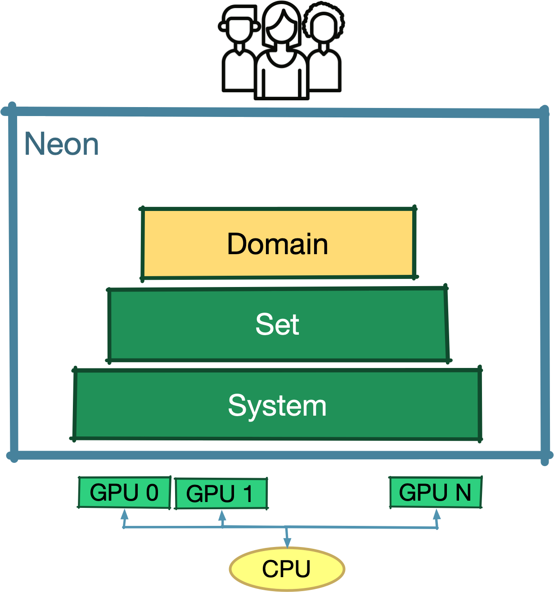
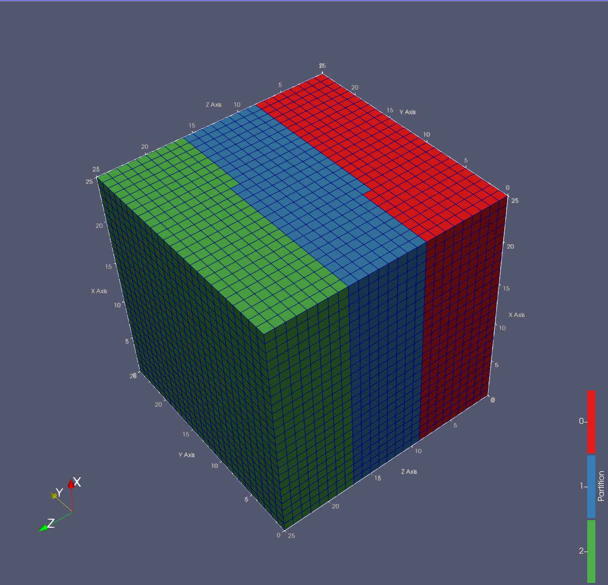

{ align=right  style="width:250px"}
# The Domain Level

Neon Domain level's goal is to provide users with simple mechanisms for some specific domains. 
Currently, Neon focus on those domains where a regular cartesian discretisations are leveraged. 
Using a simple example will look ad how the level mechanisms can be used. 

## Working with dense domains

Let's consider a simple example: a dense discrete domain where we implicitly want to represent a sphere through its signed distance function.
We'll be looking at how to implement the following in Neon:

1. [**Neon backend**: choosing the hardware for the computation](#backend)
2. [**Neon grid**: setting up the cartesian discretisation](#cartesian)
3. [**Neon field**: defining data over the cartesian discretization](#field)
5. Compute the gradient of the sphere's signed distance function (**Neon Container over fields**)

<a name="backend">
### **Neon backend**: choosing the hardware for the computation
</a>

The hardware selection process was already been introduced at the Set Level. 
Through a `Neon::Backend` object, users define the type of runtime (CUDA streams or OpenMp) and a list of resources IDs. 
In this example we decide to run on the first GPU of the system. 

!!! note

    Remember always to call `Neon::init();` to ensure that the Neon runtime has been initialized. 
    The function can be call more than once. 

```cpp linenums="2"  title="Neon/tutorials/introduction/domainLevel/domainLevel.cpp"
int main(int, char**)
{
    // Neon backend: choosing the hardware for the computation
    Neon::init();
    auto             runtime = Neon::Runtime::stream;
    // auto runtime = Neon::Runtime::openmp;
    std::vector<int> gpu_ids{0};
    Neon::Backend backend(gpu_ids, runtime);
    
    NEON_INFO(backend.toString());
    
    return 0;
}
```

The following is the information printed on the terminal by the previous code. 
``` bash title="Execution output" hl_lines="4"
$ ./tutorial-domainLevel 
[12:24:56] Neon: CpuSys_t: Loading info on CPU subsystem
[12:24:57] Neon: GpuSys_t: Loading info on GPU subsystem 1 GPU was detected.
[12:24:57] Neon: Backend_t (0x7fffdf107860) - [runtime:stream] [nDev:1] [dev0:0 NVIDIARTXA4000] 
```

In particular the last line describe the selected backend by providing the type, the number of devices as well as the device name.
In this case we are working with a Nvidia A4000 GPU. 


<a name="cartesian">
### **Neon grid**: setting up the cartesian discretisation
</a>


```cpp linenums="11"  title="Neon/tutorials/introduction/domainLevel/domainLevel.cpp"
    // ...
    
    // Neon grid: setting up the cartesian discretisation
    const int32_t  n = 25;
    const double   voxelEdge = 1.0;
    Neon::index_3d dim(n, n, n);

    // Defining the grid
    using Grid = Neon::domain::eGrid;
    std::vector<Neon::index_3d> points{{1, 0, 0}, {-1, 0, 0}, {0, 1, 0}, {0, -1, 0}, {0, 0, 1}, {0, 0, -1}};
    Neon::domain::Stencil       gradStencil(points);

    Grid grid(
        backend /** Passing the target system for the computation */,
        dim /** Dimension of the regular grid used for the discretizasion */,
        [&](const Neon::index_3d&) -> bool {
            return true;
        } /** We are looking for a dense domain, so we are interested in all the points in the grid */,
        gradStencil /** Stencil that will be used during computations on the grid */);
    
    // Exporting some information
    NEON_INFO(grid.toString());
    grid.ioDomainToVtk("myDomain");
    
    return 0;
}
```

What we get on the terminal when running the previous code is the following output:
``` bash title="Execution output" hl_lines="5"
$ ./tutorial-domainLevel 
[12:54:11] Neon: CpuSys_t: Loading info on CPU subsystem
[12:54:11] Neon: GpuSys_t: Loading info on GPU subsystem 1 GPU was detected.
[12:54:11] Neon: Backend_t (0x7ffc0e6fad20) - [runtime:stream] [nDev:1] [dev0:0 NVIDIARTXA4000] 
[12:54:12] Neon: [Domain Grid]:{eGrid}, [Background Grid]:{(25, 25, 25)}, [Active Cells]:{15625}, [Cell Distribution]:{(15625)}, [Backend]:{Backend_t (0x55e6f57a2c70) - [runtime:stream] [nDev:1] [dev0:0 NVIDIARTXA4000] }
```

By logging the grid information (`NEON_INFO(grid.toString());`), we can inspect some information of the grid directly on the terminal.
Indeed, the last line of output shows the selected grid type (eGrid in this case), the dimention of the grid, number of active cells as well as the number of cell per hardware device. 

By calling the `ioDomainToVtk` we can also inspect the created domain (`grid`) via Paraview as the code generates a vtk file (`myDomain`).
The vtk file containes information on active cells and their distribution over selected hardware devices. 
As we in the example we are using a reppresenting a dense domain, in the vtk file all the cell inside the grid will be represented as active,
the more interesting information we can get from the vtk file is the mapping between cells and hardware devices as reported in the following picture:


<a name="field">
### **Neon field**: defining data over the cartesian discretisation
</a>

### Neon Fields
```cpp linenums="17" title="Neon/tutorials/introduction/domainLevel/domainLevel.cpp"
    // Neon field: defining data over the cartesian discretization

    /** Creating a scalar field over the grid.
     * Non active voxels will get be associated with a default value of -100 */
    auto sphereSdf = grid.newField<double>("sdf" /** Given name of the field */,
                                           1 /** Number of field's component per grid point */,
                                           -100 /** Default value for non active points */);

    const double r = (n * voxelEdge / 2) * .8;

    /** Using the signed distance function of a sphere to initialize the field's values */
    sphereSdf.forEachActiveCell([&](const Neon::index_3d& idx, int, double& value) {
        double sdf = sdfCenteredSphere(idx, dim, voxelEdge, r);
        value = sdf;
    });

    sphereSdf.ioToVtk("sdf", "sdf");
```
## Neon Containers on Grids